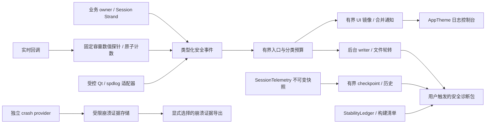

# 工业化日志与故障诊断对齐实施方案

日期：2026-09-26。版本：1.3。状态：`LG0_COMPLETE; LG1_COMPLETE; LG2_ENGINEERING_COMPLETE; LG3_ENGINEERING_COMPLETE; LG4_ENGINEERING_COMPLETE; LG5_ENGINEERING_COMPLETE; LG6_ENGINEERING_COMPLETE; LG7_ENGINEERING_COMPLETE`。LG7 的本机确定性门禁见 [LG7 证据](logging/evidence/lg7-20260927/README.md)；同机双端真实 LiveKit 共享/模拟重连及诊断事件落盘见 [L3 证据](logging/evidence/l3-livekit-20260927/README.md)，受控真实信令故障与媒体端点身份见[网络故障证据](logging/evidence/l3-network-20260927/README.md)。真实慢盘、断电、UDP/RTP 故障、跨设备、长稳和独立人工支持复盘仍为 `DEFERRED/NOT_RUN`，不宣称完整运行或发布验收通过。

源码基线：`745af69d2ce2c154a17e72890a81784b21b4de67`。本轮开始时工作区干净，与前一轮日志审查 HEAD 一致，因此复用该轮源码证据，不重复构建或测试。本方案不把历史 Build/CTest PASS 转记为新增能力的 PASS。

适用对象：Windows 原生 C++/Qt 主客户端、自有 Room/Signal/HTTP/媒体日志、已有 SessionTelemetry、稳定性账本、日志控制台及诊断导出。本文的“工业化”指可持续运行、可安全取证、可关联复盘、资源有界和可验证交付，不代表某项外部认证。

## 1. 目标、交付边界与完成定义

最终应能用用户主动导出的一份诊断包回答：哪个构建、哪次运行和会话、哪个操作、在哪个阶段失败、是否重试或降级、实际恢复到哪个媒体端点、哪些证据缺失。

必须达到以下结果：

1. 日志在 UI 未打开、UI 阻塞、会话未正常结束时仍有独立的有界留存能力。
2. 聊天正文、凭据、原始网络载荷不进入普通诊断日志、队列、UI 缓存、剪贴板及安全诊断包。
3. HTTP、admission、Room、重连、媒体及遥测可通过匿名关联标识串联；业务状态与诊断状态独立。
4. 文件不可写、队列满、导出失败、崩溃采集失败时有明确降级结果，不反向阻塞实时媒体或改变业务结果。
5. 重启后能选择事故对应的旧会话导出；包内提供版本、覆盖范围、丢失计数和完整性信息。
6. 真实崩溃、强杀、正常退出、未确认终止分别归类；崩溃证据可匹配准确构建和符号。

LG0 已冻结文档契约并形成输入指纹；LG1 的工程验收见 [LG1 记录](logging/evidence/lg1-20260926/README.md)。各阶段的工程与运行验收分别记录，不把计划预算或历史 PASS 当成当前结果。

首版不建设云端日志平台、自动上传、远程配置中心、全量分布式 tracing 或防篡改审计系统。它们按部署需求另立范围；客户端日志也不替代服务端权威业务审计。

## 2. 已有能力与差距追踪

必须复用：`secure_log` 的源头摘要与最终防御、Session Strand、不可变 Snapshot、SessionTelemetry 操作统计、TelemetryHistoryStore、StabilityLedger、AppTheme 和现有测试 fixture。

当前已有版本化 JSONL/CSV、UTC 时间、匿名会话 ID、availability/reason、后台存储队列、默认 300 个秒级桶、64 个任务、100 MiB/7 天历史、失败与丢弃计数。不可重新描述为“完全没有结构化日志或资源控制”。

以下行号对应本方案源码基线，实施时优先按符号定位：

| ID | 当前事实与根因 | 证据 | 对应工作包 |
|---|---|---|---|
| GAP-01 | Room/UI、Qt、标准流、spdlog 分散；普通日志未形成统一持久化服务 | `src/core/room.cpp:623`；`src/ui/meeting_log_console.cpp:80`；`src/media/camera_source_manager.cpp:146` | LG2、LG3 |
| GAP-02 | 聊天正文、显示名、附件名进入诊断通道；凭据黑名单不能替代内容最小化 | `src/ui/meeting_room_window.cpp:3370,3394,3418,3566` | LG1、LG3 |
| GAP-03 | UI 每条日志投递一次 queued callback；消费后的条数上限不能限制待投递队列 | `src/ui/meeting_log_console.cpp:98` | LG2 |
| GAP-04 | 自动历史只在 session_complete 时写入；持续故障现场依赖易失内存 | `src/telemetry/telemetry_report.cpp:1862,1878` | LG4 |
| GAP-05 | 写盘前设置 current_persisted_，失败未恢复；尝试状态被当成成功状态 | `src/telemetry/telemetry_report.cpp:1881,1893` | LG1、LG4 |
| GAP-06 | 关联 ID 分散；HTTP 毫秒 operationID 可能重复，未贯通 caller 日志 | `src/net/openmeeting_http_client.cpp:86,129,152`；`src/telemetry/session_telemetry.cpp:381` | LG3 |
| GAP-07 | typed error 被泛型异常摘要抹平；部分 best-effort 请求没有结果证据 | `src/core/operation.h:25`；`src/core/meeting_coordinator.cpp:2936,3305` | LG3 |
| GAP-08 | signal 输出及标准流 flush 不能提供可靠崩溃取证；confirmed crash provider 未接通 | `src/telemetry/crash_handler.cpp:31,69`；`src/app/main_meeting_app.cpp:111` | LG5 |
| GAP-09 | 报告缺构建/运行关联上下文；导出主要读取当前内存，历史会话支持流程不完整 | `src/telemetry/telemetry_report.cpp:1550,1904` | LG4、LG6 |
| GAP-10 | WebRTC 原生日志全部关闭，缺受控底层诊断；不能直接打开自由文本绕过隐私边界 | `src/rtc/webrtc_manager.cpp:533` | LG3 |

补充关注项纳入对应实现验收：报告文件缺失/截断、临时文件配额、worker 处理时刻替代采样时刻、导出异常时 callback 未完成。这些不扩大为已复现的线上事故。

## 3. 目标架构与不可破坏的约束



- 业务可变会话状态仍只有 Session Strand 一个逻辑 owner。日志服务仅拥有诊断队列、文件及状态，不持有 Room、Track、QWidget 或 D3D 资源。
- 日志入口接收不可变上下文；禁止通过“当前全局会话”给异步回调补身份。旧 generation 的回调只携带旧上下文并按现有 gate 拒绝业务访问。
- 音视频/渲染高频回调只更新数值探针或固定容量事件槽；不拼接字符串、不分配无界对象、不写文件、不等待 UI/GPU。
- 业务 owner 决定操作唯一终态。日志缺失不能补造业务终态，日志失败不能改变网络错误、重试策略、publish 结果或退出策略。
- `raw detail -> business callback` 与 `raw detail -> typed safe projection -> diagnostics` 分开。不得为脱敏改写原业务错误。
- UI 是消费者，文件留存不依赖日志窗口实例。后台首次日志不得构造 QWidget。
- 日志服务异常必须防递归；自诊断计数使用固定空间，writer 失败不得再次产生无限同类日志。
- 不修改 vendor/Reference。自有适配器承担桥接；已有第三方 crash 文件不等于产品已启用。

### 3.1 建议组件与依赖

以下均为拟新增名称，LG0 固定后再实现；当前文件不存在不能写为已交付。

| 组件/建议位置 | 职责 | 依赖方向 |
|---|---|---|
| `src/telemetry/diagnostic_event.h`、`diagnostic_catalog.*` | schema、事件目录、typed fields、级别和隐私校验 | C++ 核心，无 Qt |
| `src/telemetry/diagnostic_context.*` | run/session/operation 关联的不可变值对象 | 不取得业务 owner |
| `src/telemetry/diagnostic_pipeline.*` | bounded enqueue、优先预算、loss counters、订阅快照 | 不调用 QWidget |
| `src/telemetry/diagnostic_file_sink.*` | 单 writer、JSONL、轮转、配额和恢复 | 在 writer 上复用现有 spdlog/JSON 能力 |
| `src/ui/diagnostic_qt_bridge.*` | Qt handler、受控消息映射、UI 镜像与批量通知 | 核心 -> 值对象 -> UI |
| `src/telemetry/diagnostic_bundle.*` | 历史选择、流式打包、manifest/校验/取消 | 读取安全快照和已提交文件 |
| `src/telemetry/crash_evidence_provider.*` | provider 接口、证据校验与账本恢复 | 平台实现隔离 |
| 现有 `telemetry_report.*` | 保留原指标语义，增加分段存储和历史导出 | 不复制指标聚合器 |
| 现有 `main_meeting_app.cpp` / shutdown service | 初始化、配置、最后关闭和部署入口 | UI 不接管 native lifetime |

实现优先复用已链接的 spdlog 作为 writer 侧同步 sink；自建一个显式有界入口即可。禁止在它外面再套一个默认容量不明的 async logger，造成双队列和双重丢弃口径。

## 4. 事件、时间、关联与级别合同

### 4.1 统一事件字段

| 字段 | 要求 |
|---|---|
| `schema_version`、`event_name` | 稳定英文事件码；不以翻译后的正文为检索键 |
| `severity`、`component` | 严重级别和模块分别编码；组件使用受控枚举 |
| `occurred_at_utc_ms`、`monotonic_us` | 在发生点取时；UTC 用于粗略跨端对齐，单调时钟用于本进程耗时 |
| `event_sequence` | 本进程唯一序号；并发输出可乱序，不把序号等同因果顺序 |
| `process_run_id`、`pid`、`thread_role` | run ID 启动随机生成；线程角色优先使用 ui/session/rtc/media/writer |
| `anonymous_session_id` | admission 开始即生成；创建 Room 后沿用，早期登录失败允许为空 |
| `operation_id`、`parent_operation_id`、`request_id` | 作用域明确，复用现有 operation 序列并绑定 run/session，不重造冲突计数器 |
| `session_generation`、`room_generation`、`recovery_epoch` | 只在适用事件填写；缺失不伪装为有效零 |
| `outcome`、`stage`、`error_code`、`retryable`、`duration_ms` | 从 typed 业务结果投影；未知用 unknown/缺失，不解析原始异常字符串推理 |
| `attributes` | 每个 event_name 的有限字段集合；无任意 JSON、raw_text、extra 后门 |
| `truncated`、`redaction_version` | 标明受控安全字段截断和投影规则版本；秘密不以截断前缀保留 |

构建/环境清单按 run 保存，事件引用 build ID，避免每行重复大对象。可选安全说明由固定模板渲染；生产者不传任意自由文本。

示例仅说明结构，ID 和耗时均为虚构值：

```json
{
  "schema_version": 1,
  "event_name": "reconnect.attempt.terminal",
  "severity": "warning",
  "component": "room",
  "occurred_at_utc_ms": 1790409600123,
  "monotonic_us": 18400123,
  "event_sequence": 842,
  "process_run_id": "run_example",
  "anonymous_session_id": "session_example",
  "operation_id": "op_example_8",
  "parent_operation_id": "op_example_7",
  "session_generation": 3,
  "outcome": "failure",
  "stage": "resume",
  "error_code": "join_timeout",
  "retryable": true,
  "duration_ms": 10000,
  "attributes": {"attempt": 2, "next_mode": "full_restart"},
  "redaction_version": 1
}
```

新增可选字段保持兼容；字段改义、单位改变或移除需要版本升级。未知未来版本标 `UNSUPPORTED`，不得误判成损坏后自动删除。

公共接口迁移单独登记：已有 `Room::Log/SetLogHandler`、`PanicCallback` 等消费接口先通过适配器接收 typed event 渲染的安全文案，保留既有回调时机、次数、线程和生命周期合同。旧自由文本入口仅允许注册模板/既有安全摘要，未知输入抑制；不能因统一 sink 静默移除消费回调。确需修改签名时逐 caller 迁移、明确兼容版本，再废弃旧入口。

源事件时刻、入队时刻、写入时刻分开。telemetry 按源采样时刻合桶，不按 worker 消费时刻合桶；记录 lag。系统时间回拨保留 clock-change 事件，排序和耗时继续使用单调时钟；不同设备的单调时钟不能直接比较。

### 4.2 HTTP 与关联迁移

1. 新增本地随机/足够唯一的 request ID，绑定 admission parent；验证同毫秒并发及跨进程不会混淆。
2. 第一阶段保持现有 `operationID` wire header 和 `HttpError.operationId` 协议语义，同时记录受校验的 `legacy_operation_id`。不未经后端确认就把 UUID 写进可能要求数字的 header。
3. 请求完成 DTO 分别保留 HTTP status、Qt network error、业务错误码和本地 outcome；请求/响应 body 和 token 不进入日志。
4. `leaveMeeting/endMeeting` 的 best-effort 回调增加安全结果事件，本地退出策略不变。
5. 后端协议、字段长度及多客户端兼容验收通过后，再单独升级 wire ID；标准 trace context 属于后续可选项。

### 4.3 首版必记事件

| 链路 | 稳定事件名 | 关键内容 |
|---|---|---|
| 进程 | `process.started`、`process.stopping`、`process.terminal` | run/build、退出意图、诊断排空结果 |
| HTTP | `http.request.started`、`http.request.completed` | route 枚举、request/parent、各层错误码、耗时 |
| 入会 | `admission.started/stage_changed/terminal` | stage、cancel/failure/success、关联操作 |
| 启动 | `room.connect.started/terminal`、`startup.terminal` | generation、连接/媒体阶段、degraded_success |
| 发布订阅 | `media.publish.started/terminal`、`media.unpublish.terminal`、`media.subscription.changed` | 匿名 track、媒体类型、绑定 epoch、权限和结果 |
| 重连 | `reconnect.episode.started/terminal`、`reconnect.attempt.started/terminal`、`reconnect.mode_changed` | episode、attempt、resume/full、backoff、剩余 deadline |
| 媒体恢复 | `media.recovery.milestone/timeout` | audio/video/render、measurement_point、recovery epoch |
| 设备与渲染 | `device.switch.started/terminal`、`render.backend.changed` | 匿名设备、HRESULT、超时/回滚、backend/reason |
| 离会 | `meeting.leave.requested`、`meeting.backend_notification.completed`、`session.stopped` | 本地终态与后端通知结果分别保留 |
| 聊天与文件 | `chat.send.terminal`、`chat.received`、`transfer.terminal` | 类型、字节数、结果；没有正文、文件名和显示名 |
| 过期回调 | `callback.rejected.summary` | 来源、原因、旧 generation、次数、窗口 |
| 诊断健康 | `diagnostics.queue.summary`、`diagnostics.sink.failed/recovered`、`diagnostics.mode.changed` | 丢弃、队列峰值、持久化水位、故障和诊断窗口 |

`trace/debug` 用于协议流和重复状态；正常迁移/用户取消为 `info`；可恢复失败或降级为 `warning`；用户操作终态失败为 `error`；无法继续运行才为 `fatal`。不要把每次预期重试都记为 error。

默认至少保留 info。RAW_MSG、成功 ICE、周期 speaking 等已完成安全投影的摘要事件默认降为 debug 或窗口摘要；这里的 RAW_MSG 仅指消息类型等允许字段，不包含原始载荷。debug、trace 和诊断模式也不得放开第 5 节禁止的数据。关键终态不按任意正文去重。是否处于关键保留预算由事件目录决定，不能仅凭 severity 推断。

业务 `started/terminal/inflight/duplicate_terminal` 与诊断 `accepted/dropped/written` 分开统计。日志缺失不能被解释成业务未完成。late callback 正常拒绝采用有限键集合汇总，不能再次访问已销毁 owner。

## 5. 隐私与安全投影

| 数据类别 | 默认策略 |
|---|---|
| token、密码、Cookie、Authorization、HTTP body、聊天/文件内容、原始异常 detail、完整 SDP/ICE | 源头禁止进入诊断对象；不保留 hash，不先入队再清洗 |
| 姓名、identity、room 名、附件名、设备 ID/路径、URL host/query、IP | 不记录原文；改为受控类别或会话内匿名映射 |
| route、error category、RTCErrorType、HRESULT、socket code | 枚举/允许列表和数值范围校验后保留 |
| participant/track/device 关联 | 会话内随机映射，或随机会话密钥 HMAC；禁止裸 SHA256 低熵标识 |
| SDK/Qt 自由文本、未知 category、完整源码路径 | 未注册内容输出固定抑制事件；仅允许明确模板提取安全字段 |

映射表、密钥及原始标识不落盘，会话结束释放；跨进程不默认建立长期用户追踪 ID。保留现有 `SanitizeForOutput` 作最后防御，不能把它当成任意内容的安全许可证。

Qt handler 使用重入保护，不调用 QWidget 或 Qt 日志，不把原始消息交给旧 handler/stderr；保持 QtFatalMsg 的终止语义。自有重要 qWarning/qCritical 先迁移成 typed event，避免接管后只剩“消息被抑制”。

WebRTC 默认继续关闭原生自由文本，优先补 RTCErrorType/ICE/DTLS 的 typed 信息。受控诊断模式候选为 10 分钟、额外 20 MiB，受总配额约束并自动到期；只接受固定版本白名单事件，不采用“全部打开再 regex 清洗”。

隐私验收使用不带 token 关键词的普通 canary：聊天句子、姓名、附件名、设备 ID 等，检查所有 sink、内部安全缓存、复制文本和导出。普通日志与进程内存 dump 的隐私合同分开，见第 8 节。

## 6. 有界管线、留存和关停

以下数字为初始工程预算，不是当前实测能力。LG0 冻结参考机、场景与统计方法；LG2/LG7 用证据接受或修订，不能在失败后无记录放宽。

| 对象 | 提议预算 | 达到上限时的行为 |
|---|---|---|
| 单事件 | 总序列化载荷 ≤16 KiB；安全文本单字段沿用 ≤4 KiB | 拒绝未知/敏感字段；安全文本按 UTF-8 边界截断并标记 |
| 生产入口 | 8192 条且 8 MiB，二者先到者生效 | 普通预算满时丢弃/合并；不阻塞 producer |
| 关键预留 | 包含在入口总预算内的 1024 条且 1 MiB | 普通日志不能占用；关键区满也允许丢弃，单独计数并产生恢复摘要 |
| 限速/去重状态 | 最多 1024 个稳定目录键，5 秒窗口 | 溢出归入固定 unknown/other 计数，不用自由文本生成 map 键 |
| UI 镜像入口 | 2048 条且 2 MiB；一个待处理唤醒通知 | UI 堵塞不影响 writer；淘汰镜像并显示缺失数量 |
| UI 刷新/缓存 | 每 50 ms；每批 ≤128 条且 ≤4 ms；缓存 5000 条且 8 MiB，显示 3000 行 | 批量更新、环形缓存；满额不使用每条 vector 头删 |
| telemetry 队列 | 保留 64 jobs，增加 16 MiB 双限制 | 同会话同桶可合并；终态与控制任务预留；拒绝必须完成回调 |
| 导出 | 一个执行、一个等待；流式读取，缓冲 ≤4 MiB | 超额返回 busy，不排无界队列；不一次载入整个包 |
| 普通日志磁盘 | 10 MiB 分段，总 100 MiB，7 天 | 删除最旧且未被读取固定的本应用段；不足则拒写并计数 |
| telemetry 磁盘 | 沿用 100 MiB/7 天，包含新 checkpoint | 保留累计摘要，分段回收；标明缺失时间范围 |
| crash 存储 | 总 128 MiB/3 天，最多两个候选 64 MiB dump | provider 必须能约束或停止超限写入，否则不启用该 dump 配置 |
| 统一受管目录 | 总 512 MiB，含活动段、临时/损坏文件；临时产物预留 ≤64 MiB | 写前预算与跨进程协调；未知用户文件保留，不任意递归删除 |
| 落盘节奏 | 普通文件每 1 秒安排 flush；关键事件优先唤醒；telemetry 最迟每 15 秒安排 checkpoint | 慢磁盘下报告实际 lag/水位，不承诺调度时间就是耐久时间 |
| 重试 | 1s、5s、30s、60s，累计自动重试窗口 5 分钟 | 同一 checkpoint/report ID 幂等重试；失败后保留状态和手动重试入口 |
| 正常关停 | 排空目标 5 秒 | 停 admission，最后 checkpoint，排空或显式 degraded；无悬空 worker |

内存字节配额按队列实际持有的对象、字段缓冲 capacity、上下文引用导致的保留内存及容器开销计费，不只统计最终 JSON 长度。入队前按固定结构与有界字段计算/预留 `event_charge_bytes`，writer 不承担首次判断预算的责任；出队或拒绝及时归还预算。固定槽/arena 的基础分配也计入上限，共享对象不能通过多份引用绕过生命周期和内存预算。

普通区最多 7168 条且 7 MiB；关键事件优先使用预留区，也可借用普通区空闲预算，但任何时候入口总量不得超过 8192 条/8 MiB。普通事件不得借用关键预留；关键区及可借用空间均满时拒绝并计数，不在 producer 同步等待或扫描无界队列。其他镜像、pending report、导出缓冲分别记账，最终还须符合额外工作集目标。

有限内存、producer 不阻塞与无限关键日志零丢失不能同时保证。首版明确选择有界和不阻塞；分别记录 accepted、suppressed、dropped_by_priority、oversized、sink_failure，恢复后输出 loss marker。原子计数及最小健康快照不依赖正在故障的 writer。

磁盘配额包括应用确认归属的 `.tmp`、损坏段及进行中的报告；活动 run 使用独立目录和租约/锁，禁止清理另一活跃进程。用户导出目录不纳入后台清理，但导出本身有大小上限、空间检查和取消清理。

### 6.1 启动、写入和关停顺序

1. `main` 早期建立固定容量 bootstrap 入口和随机 run ID；此阶段只存安全事件，不依赖 QApplication。
2. 获得应用本地目录后接通 writer、Qt adapter 和 ledger，转存 bootstrap；只保留一种权威日志路径，避免旧 sink 双写。
3. `Emit/TryEmit` 不抛异常；参数构建也须受控。应用关键 producer 不等待磁盘锁、UI 或 exporter。序列化和磁盘工作放在 writer。
4. 文件打开/写入/轮转故障进入 `degraded` 状态，有限退避恢复；不忙循环、不逐条重复报错。
5. 已有 Session shutdown 完成终态发布后，关闭日志普通 admission；允许少量固定关闭事件，再排空/持久化并释放 sink。
6. 5 秒是排空目标，不是尚未证实的整个进程硬退出承诺。有界关停必须基于可取消/有截止时间的 I/O，或独立 writer 进程策略验证；普通 ostream flush/join 本身不能证明上界。LG2 原型若不满足，先解决 writer I/O 生命周期再接生产。
7. 超时不标 `persisted_clean`；不强杀线程、不 detach 捕获已释放对象。logger 不成为 native resource 清理的 owner，清理工作不在 UI 等待。

区分 `accepted`、`written`、`flushed_to_os` 和经过明确系统调用确认的 `durable_checkpoint`。标准流 flush、rename 或测试进程退出成功不自动等于断电安全；机器掉电保留独立验证边界。

## 7. telemetry 持续保存、恢复与兼容

- 保留原指标定义、availability、单位、累计计数和 300 秒内存趋势。新增磁盘分段/有界操作事件时间线，不把现有快照重复保存成无界全会话数据。
- 第一项修复是写成功才推进 `persisted_revision/segment_id`；失败保持 dirty。LG1 先解决现有标志缺陷，LG4 再引入完整状态机：`dirty -> scheduled -> writing -> committed`，失败转 `retry_pending/exhausted`。
- pending report 使用不可变快照，不能借下一会话的 current_records_ 重试上一会话。增加候选上限 4 个报告且 8 MiB；超额保留明确丢失摘要，不无界堆积。
- checkpoint 和 terminal 共用 run/session ID、段序号、source 时间范围及 revision 水位。临时段写完、校验并原子提交后更新索引，重试同 ID 不生成重复报告。
- 采样 UTC 在源头获取或以进程时钟锚点映射，并携带单调时间；worker backlog 不改写原发生时刻。
- manifest 记录完整文件列表、大小、SHA-256、覆盖起止、最后成功水位、未完成标志、丢失/截断计数。摘要中的 `complete` 表示会话业务终态，文件完整性使用独立字段。
- 启动扫描校验实际文件，缺失、截断、checksum mismatch 不能列成完整报告；仅恢复校验通过的完整段。半行 JSONL 尾部不得伪造为有效事件。
- 旧 v1 保持只读兼容，不原地改写；新持久化格式使用新版本。旧报告缺少 run/build 字段时显示 unknown，不补造历史身份。
- 未知未来版本、应用不能确认归属的目录保守保留；本应用坏段/临时段按独立隔离清理规则计入配额。
- 每个已受理 export/clear/retry 操作必须有且仅有一个终态结果，包括成功、取消、拒绝、停止、异常及磁盘失败；UI receiver 销毁时只取消投递，不访问失效 QWidget。
- 现有 telemetry 的 `SetHistoryEnabled(false)` 会清空当前记录并删除已知历史报告（当前实现 `telemetry_report.cpp:1809`）；首版保持这项既有语义，并在 UI 明确说明，不能暗中改成只停止新写入。新增普通日志留存开关独立命名，关闭只停止其新写入，删除旧日志使用明确的清除操作；不把关闭 telemetry 历史解释成关闭普通日志/核心指标。两类偏好分别测试，默认无上传。若将来统一“停留存”和“清历史”行为，需要独立的设置版本迁移方案。

## 8. 崩溃采集、隐私和符号闭环

LG5 首先做小范围 provider 选型：比较进程外 Crashpad 类方案与 Windows/WER 可部署路径的许可、x64/Qt 静态包兼容、安装依赖、权限、离线使用、失败行为及证据接口。默认倾向进程外采集，但以原型结果固定选择；不修改 vendored tdesktop 代码或据其存在宣称能力可用。

实施合同：

1. 覆盖 QApplication、登录和 Room 创建之前的异常；绑定 run/build/provider ID，正常退出仍由现有 ledger 记录。
2. crash-safe 路径不经过常规 logger 锁、JSON 分配、Qt、网络或长时间 flush；采集失败仍允许进程终止。
3. 下次启动仅对验证通过且 run/build 匹配的证据确认 crash。强杀、断电、证据缺失、不匹配均保持 UNKNOWN_TERMINATION 或对应采集失败状态。
4. 安全元信息包括异常代码、架构、模块相对地址、证据 ID/状态；环境变量、完整命令行、用户目录及任意进程内存不作为普通元信息附加。
5. dump 可能包含 token、聊天或路径，不能称“已脱敏”。默认安全诊断包不含 dump。消费版默认关闭 dump 内存采集，允许用户或企业策略显式开启；安全崩溃元信息的能力依 provider 实测声明，缺失保持 unsupported。
6. dump 保存在当前用户受限目录，验证 ACL、配额和期限；采集、导出和上传是独立策略。即使开启本地 dump，也不自动上传。
7. 每次发布保留准确 EXE/DLL/PDB、build ID、PDB GUID+Age、架构和依赖版本。dirty 内部构建必须可区分；符号不匹配标 UNSYMBOLICATED，不使用邻近版本“猜栈”。
8. 构建符号归档可以是本地/现有发布系统工件；本计划不授权向外部服务上传符号或 dump。

真实子进程验收：访问异常、abort、未捕获异常、正常退出、强杀、采集器缺失、损坏/不匹配证据、关闭期间异常、写盘失败。验证预设崩溃点可用准确符号还原，错误 PDB 被拒绝；强杀不能计为 confirmed crash。

## 9. 控制台与安全诊断包

控制台沿用 AppTheme，增加级别、组件、会话、操作筛选和 loss 状态；采用环形缓存及批量插入。关闭窗口不关闭记录，首次后台事件不创建窗口。复制可选“当前过滤结果/所选记录”，明确范围；不从展示文本反算指标。

诊断包建议内容：

```text
diagnostic-bundle/
  manifest.json             # bundle schema、选择范围、缺失项、每文件大小/hash
  build.json                # app/build/commit/dirty、依赖版本、架构
  environment.json          # 受控 OS/渲染后端/设备能力，不含用户路径或设备原始 ID
  sessions/<opaque-id>/
    events.jsonl            # 安全事件与操作时间线
    telemetry/              # 已有指标报告与持续分段
    stability.json          # 对应运行/会话的安全账本摘要
  diagnostics-health.json   # 队列、丢弃、持久化水位、导出限制
```

`ExportCurrent` 保留；新增按稳定 `report_id/session_id` 选择历史的接口。只能从应用索引解析路径，禁止把用户输入 ID 直接拼接为任意文件路径；校验 canonical path、重解析点/符号链接和文件归属。

导出前固定已提交文件快照或读租约，防止轮转同时删除读取对象；流式复制并核对 hash，取消只清理本次临时目录。未知未来格式可以单独显式导出原始本地工件，但不能把未经安全验证的内容混入“安全诊断包”。

建议普通包上限 100 MiB，超限优先缩小所选时间窗口并说明省略项。默认不包含二进制 dump、用户文件、命令行或原始配置。UI 展示时间范围、估计大小、包含项、缺失项和目的地；成功/失败/取消都有终态，进度窗不能永久悬挂。

## 10. 分阶段工作包、依赖与交付

人日为单名熟悉项目的工程师有效工作量估计，包含实现和直接验证，不包括外部环境等待。总计约 24～37 人日；多人的并行收益取决于公共契约稳定性，不能直接承诺日历交付日期。

| 阶段 | 工作包与主要交付 | 前置 | 角色 | 估计 | 唯一工程 gate |
|---|---|---|---|---|---|
| LG0 | 契约、事件目录、迁移清单、预算、基线与证据模板 | 本方案 | 核心/安全/QA | 1～2 日 | None；如新增可运行验证器则按其实际影响选 gate |
| LG1 | 内容隐私收口、自动历史失败标志修复 | LG0 | UI/telemetry | 2～3 日 | L1 focused |
| LG2 | 核心有界管线、文件 sink、Qt 批量桥、启动/关闭 | LG0、LG1 | 核心/平台/UI | 4～6 日 | L1 focused；触及结构性 threading 时替换为 L2 |
| LG3 | HTTP、Room、重连、媒体迁移；typed error；噪声治理 | LG2 | 网络/会话/媒体 | 4～6 日 | L1 focused；实际重构核心 owner 时替换为 L2 |
| LG4 | 持续 checkpoint、恢复、兼容、事件时间线、完整性 | LG2，最终联调依 LG3 | telemetry/存储 | 3～5 日 | L1 focused |
| LG5 | crash provider、账本恢复、部署、符号策略 | LG2；选型可提前 | Windows/发布 | 4～6 日 | L1 focused；真实采集另记 L3 |
| LG6 | 历史导出与诊断包、日志控制台完善 | LG3、LG4；crash 元信息依 LG5 | UI/支持工具 | 3～4 日 | L1 focused |
| LG7 | 故障/负载/支持复盘验收、参数定版和交付 | LG1～LG6 | QA/核心/支持 | 3～5 日+外部等待 | 阶段作为 Release/Snapshot 时 L2 一次；L3 独立矩阵 |

每个工作包可对应独立审查单元，但不自动创建或提交 PR。跨同一文件的并行修改必须先划分 owner；例如 LG3 与 LG4 共用 telemetry_report 时串行合并，不让两个工作包同时改同一段。

### LG0：冻结可实施合同

- [x] LG0-01：建立事件目录，逐个规定字段类型、隐私分类、级别、关键预算属性、来源 owner、最大长度、版本兼容。
- [x] LG0-02：列自有日志调用点的迁移清单；第三方输出登记适配器边界，不扫描改写全部 vendor。
- [x] LG0-03：冻结 logger ID 与已有 telemetry ID 的映射，记录 HTTP legacy header 不变的兼容要求。
- [x] LG0-04：登记参考机、构建配置、媒体负载及已有 CPU/内存/回调成本和故障证据，标明采集日期/指纹。缺少的基线列出 LG2/LG7 的采集步骤；本契约阶段不启动新 runtime 实验，未测项为 NOT_RUN，不能填目标值代替实测。

LG0 交付：`docs/telemetry/logging/event-catalog.json`、`migration-map.csv`、`baseline.json` 和目录 `README.md`。事件 schema 与预算仍是拟实施契约，不是已运行的组件。

退出条件：目录覆盖第 4.3 节；每个 GAP 有工作包和验收项；预算可测；新老 schema、留存偏好和未知状态语义明确。

### LG1：先关闭已知隐私与保存缺口

- [x] LG1-01：修改 `meeting_room_window.cpp` 的聊天/附件诊断，只留类型、大小和结果；修改 `camera_source_manager.cpp`、`dshow_capture.cpp`、`wasapi_capture.cpp` 及摄像头 UI 日志回调的设备原文输出。过渡期使用固定安全模板，不等待整套 logger 完成。
- [x] LG1-02：修改 `telemetry_report.*` 的保存标志，成功才标 persisted；同会话 terminal 再次触发可安全重试，失败状态可见。完整自动退避放 LG4。
- [x] LG1-03：扩展相关真实控制台/UI fixture 与 `test_telemetry_report`，验证普通 PII canary、不可写后恢复及幂等；不新建语义重复测试。

退出条件：本阶段已确认的聊天、附件和设备原文入口关闭；缓存/复制不泄露 canary；首次写失败后同会话可重试成功；业务聊天/附件/网络行为不改变。其余身份及网络日志按迁移清单在 LG2/LG3 收口。

回滚：保留隐私修复，保存逻辑失败时降级到明确“未保存”，不能恢复提前成功标志或原文输出。

### LG2：统一基础设施并证明有界

- [x] LG2-01：实现 typed event/context、容量与字节双上限、关键预留、固定维度计数；入口 noexcept，所有动态字段先做安全投影。
- [x] LG2-02：实现单 writer、JSONL、轮转、目录权限/归属、磁盘失败退避、可取消关停原型；把 App 初始化和 shutdown 接通。
- [x] LG2-03：控制台改成独立 UI 镜像和一个待处理通知；保留过滤、复制、AppTheme；后台不构造 widget。
- [x] LG2-04：先将启动、鉴权、shutdown 等重要自有 Qt/spdlog 输出映射为 typed event 或登记安全模板，再启用受限适配器接管；未知第三方文本抑制。迁移表未覆盖关键消息时不能启用接管。消除递归和原始 handler 双写，LG3 再迁移剩余调用点。
- [x] LG2-05：新增有必要的 pipeline/storage/Qt bridge fixture，覆盖并发、满载、writer 失败、首次后台调用、关闭竞争及 Qt fatal 子进程。

LG2 工程记录（2026-09-26，HEAD `745af69` 加未提交工作树）：固定大小事件与 8192 条/8 MiB 入口、1024 条/1 MiB 关键预留；受限 Qt/spdlog 适配器；独立 UI 队列；按随机 run 隔离的 10 MiB JSONL 分段、100 MiB/7 天回收、跨进程配额互斥及活跃 run 租约。目录写入前验证当前用户归属和通用用户组读写权限；未知正文与不合规事件在缓存/落盘前抑制。`process.issue` 的 `reason_code` 是 `invalid_sign_in_options`、`sign_in_failed`、`native_cleanup_failed`、`session_invalidated`、`qt_fatal` 五种固定值，没有自由文本。

验证：Debug 应用及相关四个测试目标增量构建通过；`diagnostic_pipeline_test`、`diagnostic_qt_bridge_test`、`qt_log_redaction_test`、`meeting_chat_log_privacy_test` 共 4/4 PASS。fixture 覆盖 100 万次并发入口尝试、配额/轮转/活跃 run 保护、失败后恢复、关闭竞争、首次后台日志、Qt fatal 子进程与混合隐私 canary。5 秒是排空目标；超时调用 Windows `CancelSynchronousIo` 并等待 writer 退出，结果标为 `timed_out`。真实慢盘/驱动不响应、断电耐久、CPU/p99 和长稳未测，分别保持 `NOT_RUN`；这些工程测试不证明硬退出时限或 Production Ready。

主要修改：拟新增 diagnostic 组件、`main_meeting_app.cpp`、`meeting_log_console.*`、`CMakeLists.txt`、`cmake/CohavoraMeetingUiTargets.cmake` 和对应 tests/cmake。

退出条件：无 producer 同步 I/O；所有队列/映射/缓存有条数和字节界；UI 阻塞不阻塞 writer；正常/失败关停无悬空对象；能读取进程强制终止前已提交的日志段。

### LG3：关键业务链路迁移与诊断保真

- [x] LG3-01：`openmeeting_http_client.*`/`http_types.h` 增加本地 request/parent、分层错误 DTO 和安全完成事件；修改 caller 传播，补离会后端通知结果，保留旧 wire header。二次 DTO 解析失败以相同 request ID 的独立事件表示。
- [x] LG3-02：`room.*`、`meeting_coordinator.*` 复用 operation/generation，记录 connect/startup/单轨与 batch publish/unpublish/reconnect/leave 的阶段和唯一终态；把 OperationError 转为 typed safe fields。
- [x] LG3-03：`webrtc_manager.*` observer 旁路投影 RTCError 枚举，不破坏现有业务错误语义；设备/渲染日志迁移为受控事件。
- [x] LG3-04：迁移自有 std::cout/cerr/spdlog/qWarning 重要输出；旧 `telemetry.h` 的残余 console 指标核对 caller 后停用重复口径，保留 SessionTelemetry 正式指标及 Room 旧回调的安全固定摘要。
- [x] LG3-05：仅对已安全投影的 RAW_MSG 类型摘要/周期事件分级采样、late callback 有界摘要；有限诊断窗口按检查时钟到期关闭且不开放原载荷；新增绕过扫描，只扫描自有新增/变更调用点，紧急崩溃路径例外留待 LG5 收口。

退出条件：可从事件串起 admission→HTTP→connect→媒体降级；可区分每次 resume/full retry；backend leave 失败与本地退出结果分离；旧 generation 不归到新会话。所有关键链路有受控 code，不只剩 opaque exception。

### LG4：持续现场、恢复与旧格式兼容

- [x] LG4-01：实现 source timestamp、15 秒 checkpoint 调度、terminal/重要故障优先安排、独立 pending report；水位仅成功推进。
- [x] LG4-02：新增分段 manifest/校验、读取恢复、临时/坏段配额、并发 run 协调；保持旧 v1 只读。
- [x] LG4-03：增加有界操作终态时间线，复用业务事件来源；不靠解析文本重算指标。
- [x] LG4-04：补有限重试和手动重试入口，export/clear/retry 的成功、拒绝、取消、异常、停止均恰好一个结果。

LG4 工程验收：source UTC/monotonic 时间、15 秒 checkpoint、终态优先、跨会话 pending、持久丢失范围、v2 SHA-256 分段与旧 v1 只读恢复、并发 run 锁、读租约、总配额、有限重试及历史安全包已接入。安全时间线与 EXE SHA-256 build ID 进入 v2 包；队列与内存趋势有条数/字节双界，产品控制闭包内联固定容量。具体边界、门禁和外部延后场景见 [LG4 证据](logging/evidence/lg4-20260927/README.md)。旧 v1 仅只读索引，其安全包导出留给 LG6 兼容工作流处理。

退出条件：长会话可定位保留窗口，崩溃后读出最后成功 checkpoint；磁盘恢复后幂等保存；旧报告仍可读取，损坏报告不会显示 complete；下一会话不覆盖尚待保存的上一会话。

### LG5：接通真实崩溃证据

- [x] LG5-01：完成 provider 原型与选型记录，固定部署、许可、采集开关、内存敏感性及失败策略。
- [x] LG5-02：替换 signal 内复杂输出，启动时接通 run/build，恢复时对接 `StabilityRecoveryEvidence`，保留 unknown 分类。
- [x] LG5-03：当前构建记录 EXE SHA-256 与 CodeView PDB GUID+Age；测试缺失采集器、错误符号、受限目录、配额和清理。Release 工件及 DLL/PDB 归档仍需实际发布环境验证。
- [x] LG5-04：执行第 8 节隔离故障子进程矩阵，分别记录采集和符号化 verdict；产品现场故障仍为外部验收。

LG5 工程门禁及选型限制见 [LG5 证据](logging/evidence/lg5-20260927/README.md)。当前 provider 为 Windows 固定崩溃元信息，默认不采集内存 dump；不将强杀或缺失证据推断为已确认崩溃。

退出条件：启用采集的支持环境下，预设访问异常可被确认并定位到准确构建；强杀不误分类；dump 默认不入安全包；不支持环境清楚显示限制。

### LG6：历史会话与支持工作流

- [x] LG6-01：增加 `ExportReport`/选择时间范围，历史索引与当前内存分离；重启后可选旧会话。
- [x] LG6-02：实现流式 bundle、hash、missing/truncated/loss 清单、环境安全 DTO、path 校验、读租约、取消清理。
- [x] LG6-03：完善日志筛选、缺失提示、历史选择、导出进度/错误；沿用 AppTheme，多语言只作用于显示模板。
- [ ] LG6-04：程序化只读包支持复盘已验证；另一名人工审阅者的独立复盘需外部人员，`DEFERRED`。缺失答案必须指出缺哪类证据。

退出条件：无需复现用户会议就能关联请求和失败阶段；安全包可独立校验，旧会话可导出，取消/失败不会永久挂起进度窗。

### LG7：故障、性能和交付验收

- [x] LG7-01：执行第 11 节当前可运行的故障/负载矩阵，冻结原候选预算；不能为获得 PASS 删除失败样例。外部 L3 独立列为 DEFERRED/NOT_RUN。
- [x] LG7-02：核对兼容期输出与例外、构建/符号和支持操作说明；结论及限制见 LG7 证据。
- [x] LG7-03：作为最终 Snapshot 工程收口，在最终源码上执行一次 L2；真实服务/设备/长稳结果单独列 L3。
- [x] LG7-04：生成最终覆盖表，区分 IMPLEMENTED、VERIFIED_DETERMINISTIC、VERIFIED_RUNTIME、DEFERRED、UNSUPPORTED；所有高优先目标有结果或明确未关闭原因。

LG7 工程门禁与 LOG-T01～T15 的逐项结论见 [LG7 证据](logging/evidence/lg7-20260927/README.md)。LG6-04 的另一名人工审阅者仍未到场，故保留未勾选及 DEFERRED，不把程序化复盘冒充独立人工复盘。

## 11. 验证矩阵与性能预算

### 11.1 有效性与故障用例

| 用例 | 操作 | 必须证明的结果 | 类型 |
|---|---|---|---|
| LOG-T01 隐私 | 普通聊天/姓名/文件名/设备 ID 及 token canary 贯穿真实入口 | 所有安全 sink、缓存、复制、导出无原值；业务 payload 保真 | L1 focused |
| LOG-T02 Schema | 未知字段、非法 ID、超长 UTF-8、安全错误枚举 | 拒绝/截断语义明确；已知原因仍可区分 | L1 focused |
| LOG-T03 满载 | 多 producer 打满普通区与关键区，至少 100 万条合成事件 | 条数/字节界不破；分级丢失可核对；无死锁/无界映射 | L1 focused |
| LOG-T04 UI | UI 阻塞 10 秒，后台继续发送；关闭/重新打开控制台 | 只有一个刷新通知；writer 独立；恢复显示 loss；无非 UI widget 构造 | focused + 产品 L3 |
| LOG-T05 存储 | 注入 open/write/flush/rename 失败后恢复 | 水位不提前成功；有限重试、幂等、状态可见 | L1 focused |
| LOG-T06 强杀 | 隔离子进程写入已确认 checkpoint 后强制终止再启动 | 成功段可读、未完成明确、不计 confirmed crash | L3 故障进程 |
| LOG-T07 关停 | producer/导出/flush/Session 退出并发，另注入慢 I/O | 无悬空访问；控制任务唯一终态；排空结果真实 | L1 focused + L3 |
| LOG-T08 兼容 | v1、新版、未来版本、缺文件、截断、坏 hash 混合目录 | 兼容/unsupported/corrupt 分别处理；保留未知用户文件 | L1 focused |
| LOG-T09 HTTP | 同毫秒请求、取消、迟到、各层错误、legacy header | request 唯一、parent 正确、wire 兼容、旧 generation 无污染 | L1 focused |
| LOG-T10 重连 | resume 失败转 full，媒体部分恢复，终态重复/迟到 | attempt/episode 可复盘，业务/日志缺失分母独立 | L1 focused；真网另 L3 |
| LOG-T11 Crash | 访问异常/abort/未捕获异常/强杀及 provider 故障 | 正确分类；有效证据确认；准确符号还原 | L3；parser 使用 L1 |
| LOG-T12 Bundle | 重启选旧报告，导出与轮转竞争，取消/空间不足/恶意 ID | 文件一致、hash 有效、路径不越界、回调必达、默认无 dump | L1 focused + L3 UI |
| LOG-T13 配额 | 多 run、临时/坏段、长期写入与读租约 | 总预算可控，活跃文件不误删，无无限重试 | L1 focused + L3 存储 |
| LOG-T14 支持复盘 | 入会降级、重连恢复、后端离会失败各产一个包 | 审阅者能定位构建、操作、阶段、结果及缺口 | L3 产品演练 |
| LOG-T15 留存偏好 | telemetry 关闭、普通日志关闭/清除、重启恢复设置 | telemetry 保持既有清除语义；普通日志两项操作独立；不影响核心指标或偷偷恢复留存 | L1 focused |

故障实验使用专用临时目录、隔离进程和受限测试卷；禁止占满系统盘、强杀用户会议或破坏真实历史。断电耐久性未执行时单独标 NOT_RUN，不由强杀测试替代。

### 11.2 初始性能接受标准

在同一参考机、相同构建/媒体负载上比较“新日志正常级别开启”与“仅关闭新日志生产/持久化”的对照，核心 SessionTelemetry 保持相同设置。先预热，至少三次配对运行，记录分位数、样本量与波动；不可将旧 logger 与新 logger 不同负载简单相减。

| 指标 | 候选标准 | 限制 |
|---|---|---|
| 非实时 producer TryEmit | p99 ≤100 μs，不等待磁盘/UI | 不是线程调度最大延迟承诺；另报最大值与竞争情况 |
| 实时回调 | 新增路径无堆分配/文件 I/O/阻塞锁；原探针路径复用 | 回调 p99 相对增幅目标 ≤5%，必须真机验证 |
| CPU | 正常级别开启的进程 CPU 平均增量 ≤2 个百分点 | 记录机器、路数、分辨率与采样口径；不把百分比和百分点混用 |
| 新增诊断内存 | 稳态额外工作集候选 ≤64 MiB，且各队列遵守硬配额 | 包含镜像/格式缓存/导出缓冲；crash provider 单列，不隐藏开销 |
| UI | 正常日志刷新每批 ≤4 ms，平均频率 ≤20 Hz | 所有 DPI/语言下按产品支持范围检查；峰值如实记录 |
| 正常日志量 | 目标平均 ≤100 KiB/分钟，事件洪峰另报 | 磁盘硬配额始终生效；不能通过删关键终态达标 |
| 长稳 | 8 小时会议及至少 100 次生命周期循环，诊断资源无无界增长 | 长稳与循环是两项；没有服务/硬件条件保留 DEFERRED |

任何阈值调整都记录原值、新值、原因和实测样本；不得把“最终有界”扩大为“无任何媒体影响”。

### 11.3 Gate 与命令合同

本轮是文档 Gate None：只做内容、引用、格式和工作区边界检查，不 build/CTest。

未来阶段优先复用有效 `build-debug`：当前 cache 指向本工作区、Visual Studio 18 2026、BUILD_TESTING/Qt tests/app 均启用。CMake、依赖或 build tree 未改变时不 configure。新增 target 必须完成必要的 CMake 再生成；不为获得新证据重复无关 configure。

拟新增测试 target 仅限确有新风险的 fixture：`test_diagnostic_event`、`test_diagnostic_pipeline`、`test_diagnostic_storage`、`test_diagnostic_qt_bridge`、`test_diagnostic_bundle`、`test_crash_recovery`。名称在 LG0 冻结，未实现前不可直接运行以下示例。

各阶段在 `tests/cmake` 给自身新测试和直接受影响的已有测试配置 `LOGGING_LG<n>` 标签；这些标签是拟新增，不是当前已有。每个标签建立明确的 target 映射，不假定 CTest 会自动 build。已有可复用 target 包括 `test_log_redaction`、`test_connection_log_redaction`、`test_qt_log_redaction`、`test_session_telemetry`、`test_stability_ledger`、`test_telemetry_report` 及对应 HTTP/生命周期 fixture。

LG2 示例（必须在 target/label 已落地之后执行）：

```powershell
# 先核对本阶段 label 包含的测试，并构建全部对应 target。
ctest --test-dir build-debug -C Debug -N -L '^LOGGING_LG2$'
cmake --build build-debug --config Debug --target cohavora_app test_diagnostic_pipeline test_diagnostic_storage test_diagnostic_qt_bridge --parallel
git diff --check
ctest --test-dir build-debug -C Debug -L '^LOGGING_LG2$' --output-on-failure
```

示例 target 列表仅对应示例 fixture；若 label 包含已有隐私等测试，应把其实际 target 一并加入同一次 build。新公共组件必须至少 build 实际产品 consumer `cohavora_app`，不能仅构建孤立 mock。

Windows 上首次运行任何上述 MSBuild 驱动构建，应直接申请获准环境并保持原命令，理由为：“MSBuild 需要只读访问用户目录中的 Visual Studio/Windows SDK 定位信息。”不得先在沙箱试跑，再把 SDK 权限问题当源码失败。

L1 选择能够完整覆盖本次风险的 focused 集合或 CORE_REGRESSION 之一；不能将 targeted→focused→core 顺次全部执行。涉及结构性 Session/thread/owner 改造时用 L2 替换该次 L1。LG7 若为最终 Snapshot/Release gate：

```powershell
cmake --build build-debug --config Debug --target ALL_BUILD --parallel
git diff --check
ctest --test-dir build-debug -C Debug --output-on-failure
```

L2 已覆盖的较小测试不再次拆跑。迭代只跑失败/直接影响测试，稳定后执行一次所选最终 gate。源码、测试、CMake、构建配置、工具链和运行环境指纹不变时复用结果；构建配置不同的证据不能互换。

## 12. 迁移、发布与回滚

迁移顺序：固定安全模板止漏 → 新事件/管线 → Room/HTTP/关键媒体 → 剩余自有输出 → 旧适配器退休。过渡双写仅允许向两个安全 sink 输出，保留相同 event sequence；不得继续写原始 payload。

默认配置和运行时开关必须可查询：级别/组件、日志留存、telemetry 历史、受控诊断模式到期时间、crash 采集策略分别展示。设置改变写安全事件，诊断模式不得提升为原文采集。

| 触发条件 | 回滚/降级动作 | 不可退回的边界 |
|---|---|---|
| 新 exporter 出错 | 关闭该 exporter，保留本地安全事件与原报告 | 不删除用户历史，不伪报导出成功 |
| writer 性能超标 | 降低 debug/重复事件量、暂停文件留存，保留有界安全缓冲和健康状态 | 不恢复实时线程同步打印 |
| 新格式解析问题 | 停止新版写入，保留文件，只读旧格式并标限制 | 不原地降级重写未知版本 |
| crash provider 不稳定 | 禁用 provider，后续运行采集能力标 unsupported，缺证据终止保持 unknown | 已确认的历史 crash/证据不降级，不把未知退出伪记正常或确认崩溃 |
| 新上下文传播错误 | 停用有问题的关联投影，显式 unknown，修复后恢复 | 不改变业务 generation/owner/retry 语义 |
| 隐私测试失败 | 停止相关事件输出/导出并修复源头 | 不恢复聊天正文、设备 ID、raw SDK 输出 |

不把“已有安全 sink”当作允许所有新字段进入的理由。新增事件/字段需要目录、隐私分类、来源 owner 和相关 fixture 同步变更。

## 13. 证据、状态与执行入口

每个阶段在 `docs/telemetry/logging/evidence/<phase>-<timestamp>/` 保存一份证据清单，至少包含：

- 源码 HEAD、dirty patch 指纹；源码/测试/CMake 输入 hash，构建目录、配置、工具链和依赖标识。
- 本阶段变更范围、实际 gate、命令/退出码、失败与修复记录；不覆盖旧失败证据。
- 实际预算、测量机、负载、时间窗口、样本量、drop/write-failure/retry/lag 与运行结果。
- 场景状态 `PASS/FAIL/NOT_RUN/DEFERRED/UNSUPPORTED` 及原因；构建、确定性测试、真实运行分别记录。
- 未完成任务、回滚开关及风险；是否具备本阶段退出条件。

阶段完成必须同时满足：任务勾选、受影响 caller/callee 审查、所选 gate 有效、差距项映射、最终 diff/status 核对。确定性工程验收关闭不自动等于所有 L3 或整个项目 Production Ready。

当前执行入口：**本机可执行的 LG0～LG7 工程工作已收口；最终计划级验收见 [FINAL_COMPLETION](logging/evidence/FINAL_COMPLETION.md)。同机双端真实 LiveKit 共享/模拟重连矩阵、私有诊断事件落盘及受控真实信令故障恢复已完成限定范围 L3；独立人工支持复盘、跨设备、UDP/RTP 故障、发布工件和长稳验收保持 DEFERRED/NOT_RUN，待具备相应外部条件后继续。**

LG2 契约稳定后允许 LG3、LG4 和 LG5 在不同文件 owner 下并行。没有真实服务、第二套设备或长稳环境时，完成不依赖它们的工程工作，并保持对应 L3 为 DEFERRED。
